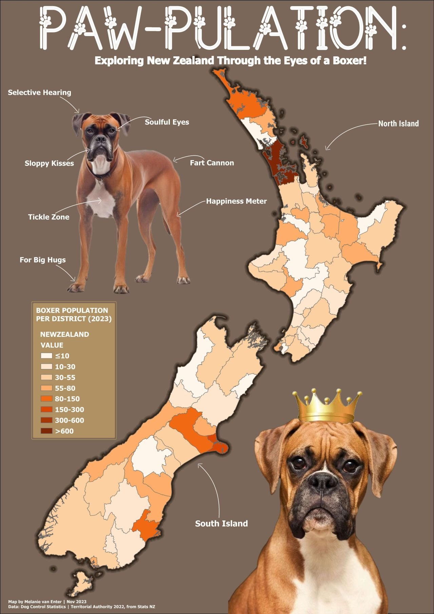

# 🥊 Boxers of New Zealand
 
A district-level map of where Aotearoa's Boxer dogs live — population by territorial authority.
Inspired, of course, by one very good girl. 🐾
 
<!-- TODO: adjust the image path to wherever the hero image lives in this repo -->
## Overview
 
A small, fun cartography project: a choropleth showing how New Zealand's Boxer population is spread across districts. Part data map, part love letter to the breed — my own Boxer, Juniper, is the reason this exists.
 
<!-- TODO: 1–2 sentences on anything that surprised you in the data (which district had the most? any regional patterns?). -->
 
## The map
 

        
         <b>Boxers of New Zealand</b> Population by district
      

## Data
 
- **Boxer population by district** — <!-- TODO: THIS IS THE KEY ONE. Where did the counts come from? Council dog-registration data? A LGOIMA request? An open dataset? Cite it clearly, including the year. -->
- **District boundaries** — [LINZ Data Service](https://data.linz.govt.nz/) territorial authority boundaries (CC BY 4.0)
- **Projection** — NZGD2000 / NZTM (EPSG:2193)
## How it was made
 
- **Software:** <!-- TODO: QGIS, ArcGIS Pro, Python? -->
- **Method:** joined the Boxer counts to district polygons and classified them into a choropleth. <!-- TODO: note your classification scheme (quantiles, natural breaks?) and colour ramp -->
## Notes
 
A couple of honest caveats worth stating so readers know how to read the map:
 
- Counts reflect **registered** dogs only, so the true population is likely higher. <!-- TODO: keep/adjust depending on your source -->
- Raw counts favour high-population districts; consider whether a per-capita or per-1,000-dogs view would tell a fairer story. <!-- TODO: mention if you normalised, or leave as a known limitation -->
## Attribution & licence
 
District boundaries © [Toitū Te Whenua LINZ](https://data.linz.govt.nz/), licensed CC BY 4.0.
 
<!-- TODO: choose a licence for this repo and state it here. -->
 
---
 
Made in Canterbury, Aotearoa 🇳🇿 · with input from Juniper · [github.com/mvanenter](https://github.com/mvanenter)
